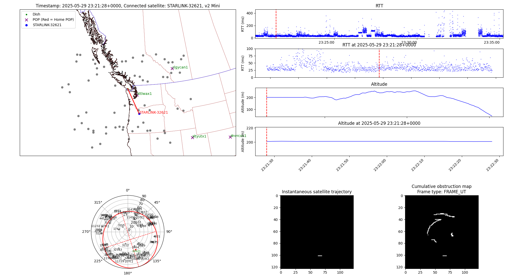
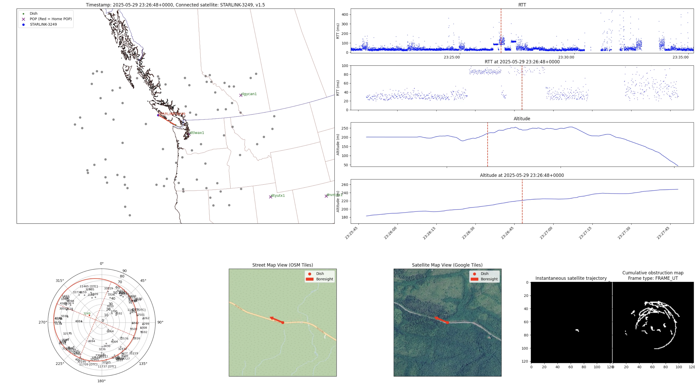

# LEOViz

[](https://github.com/clarkzjw/LEOViz/actions/workflows/release.yaml) 
 

⚠️ This repository provides a **Proof-of-Concept** implementation to visualize the connected satellites, *SINR* (OneWeb only) and network latency of Starlink and OneWeb user terminals, in either stationary or mobility (e.g., mounted on vehicles) mode. The implementation is not optimized for performance and real-time and is intended for research purposes only.

🔗 Check out https://oac.uvic.ca/starlink/ for related research and projects.

**Table of Contents**

- [Starlink](#starlink)
    - [How to](#how-to)
        - [Prerequisites](#prerequisites)
        - [Data Collection](#data-collection)
        - [Data Collection Output](#data-collection-output)
        - [Visualization](#visualization)
        - [Example Visualization](#example-visualization)
    - [Citation](#citation)
- [OneWeb](#oneweb)

# Starlink

**The ability to export SINR measurements (`phyRxBeamSnrAvg`) on recent Starlink dishes was only temporarily available in early April 2025, appeared in firmware version `2025.04.08.cr53207` and alike. It has since been removed through firmware updates. The measurement shown in the video below was recorded on April 15, 2025. It is archived here for reference.**

[](https://onlineacademiccommunity.uvic.ca/starlink/wp-content/uploads/sites/8876/2025/04/victoria.mp4)

*(Click to watch the video)*

----

Currently, this implementation provides a *record-and-replay* visualization of the connected satellites and other measurement metrics, with *near real-time* (15 seconds / 1 timeslot delay) capabilities to estimate the connected satellites, which is possible to be integrated with a Grafana dashboard, and / or [CesiumJS](https://cesium.com/platform/cesiumjs/) for interactive visualization.

## How to

### Prerequisites

+ Docker

  To install Docker on Linux, you can use `curl -fsSL https://get.docker.com | bash` or follow the instructions on the [Docker website](https://docs.docker.com/get-docker/).

  OCI containers such as Podman might work, but it is not tested.

  Pre-built Docker images for `linux/amd64` and `linux/arm64` are available at [docker.io/clarkzjw/leoviz:starlink](https://hub.docker.com/r/clarkzjw/leoviz/tags).

+ Tailscale

  If you have Tailscale installed on the same device that you are going to run this tool, consider running `sudo tailscale up --netfilter-mode=off` to avoid CGNAT conflicts. Otherwise, `100.64.0.1` is not ICMP reachable.

+ Location Access

  If you want to conduct measurements with the mobility mode of this tool, you need to enable location access from the Starlink app (`Advanced`->`Debug data`->`Starlink location`->`Allow access on local network`).

  You can verify by obtaining the coordinates of your dish using the following [grpcurl](https://github.com/fullstorydev/grpcurl) command:

  ```bash
  grpcurl -plaintext -d "{\"get_location\":{\"source\": \"GPS\"}}" 192.168.100.1:9200 SpaceX.API.Device.Device/Handle
  ```

  Otherwise, you will see the following error:

  ```bash
  ERROR:
    Code: PermissionDenied
    Message: GetLocation requests are not enabled on this device
  ```

+ **[Deprecated]** Starlink dish firmware `2025.04.08.cr53207` or later

  Since firmware version [`2025.04.08.cr53207 / 05de8289-7bcc-476b-ad62-8cf8cc2a73fe.uterm_manifest.release`](https://github.com/clarkzjw/starlink-grpc-golang/blob/a5267431cc5fc0560c50918afa1c0daff20b4b3f/pkg/spacex.com/api/device/dish.pb.go#L1369), Starlink gRPC interface exposes `phyRxBeamSnrAvg` in the `get_status` method. Note that depending on the dish hardware model, the supported firmware version might differ. You can check whether your current firmware version exposes this field by running the following command with [`grpcurl`](https://github.com/fullstorydev/grpcurl):

  ```bash
  grpcurl -plaintext -d {\"get_status\":{}} 192.168.100.1:9200 SpaceX.API.Device.Device/Handle | grep phyRxBeamSnrAvg
  ```

### Data Collection

**LEOViz** supports two data collection modes: `stationary` and `mobility`.

The `stationary` mode is for dishes with fixed locations, while the `mobility` mode can be used for dishes mounted on moving vehicles. You can still run the `mobility` mode with a stationary dish to collect Starlink GPS statistics.

**Stationary mode**

```bash
docker run -it --rm \
  -v ./data:/app/starlink/data \
  --network host \
  clarkzjw/leoviz:starlink \
  poetry run python3 main.py --run-once --lat LAT --lon LON --alt ALT
```

**Mobility mode**

```bash
docker run -it --rm \
  -v ./data:/app/starlink/data \
  --network host \
  clarkzjw/leoviz:starlink \
  poetry run python3 main.py --run-once --mobile
```

Or you can use IPv6 gateway address in `STARLINK_DEFAULT_GW`. You can find out the IPv6 gateway address by running `mtr`/`traceroute`, and it is usually the second hop if the dish is not in bypass mode.

**Optional environment variables**

| Environment variables   	| Default value      	| Note                                                                                                                                     	|
|-------------------------	|--------------------	|------------------------------------------------------------------------------------------------------------------------------------------	|
| STARLINK_DEFAULT_GW     	| 100.64.0.1         	| Starlink gateway IP. Support both IPv4 or IPv6. <br>Only need to be changed when <br>(1) the dish is in bypass mode or <br>(2) the dish has public IPv4 address (e.g., business plan), or <br>(3) you want to do IPv6 measurements. You can find out the IPv6 gateway IP address by running `mtr`/`traceroute`, and it is usually the second hop if the dish is not in bypass mode.           	|
| STARLINK_GRPC_ADDR_PORT 	| 192.168.100.1:9200 	| Starlink gRPC interface IP address<br>No need to change this option unless you know your network topology is configured with specific settings (e.g., bonding, SD-WAN, multiple dishes connected in LAN). |
| IFCE                    	| <Empty\>            | The network interface that is connected to Starlink. If specified (e.g., `eth0`, `enp2s0`), `-I` option with the specified value is passed to `ping`. 	|
| DURATION                	| 2m                 	| Measurement duration.                             	|
| INTERVAL                	| 10ms               	| ICMP echo requests interval sent by `ping`.        	|

Optional environment variables can be passed to the container using either the `-e` or `--env-file` option. E.g.,

```bash
docker run -it --rm \
  -e STARLINK_DEFAULT_GW=100.64.0.1 \
  -e STARLINK_GRPC_ADDR_PORT=192.168.100.1:9200 \
  -e IFCE=eth0 \
  -e DURATION=5m \
  -v ./data:/app/starlink/data \
  --network host \
  clarkzjw/leoviz:starlink \
  poetry run python3 main.py --run-once --mobile
```

### Data Collection Output

You will see the following message on the terminal:

```
Starlink gRPC address: 192.168.100.1:9200
Starlink gateway: 100.64.0.1
Measurement interval: 10ms
Measurement duration: 2m
[2025-05-30 23:51:26,666] [INFO] ICMP_PING, <_MainThread(MainThread, started 124061054843776)>
[2025-05-30 23:51:26,670] [INFO] GRPC_GetObstructionMap, <_MainThread(MainThread, started 124061054843776)>
[2025-05-30 23:51:26,675] [INFO] GRPC_DishStatus, <_MainThread(MainThread, started 124061054843776)>
[2025-05-30 23:51:26,685] [INFO] GRPC_GPSDiagnostics, <_MainThread(MainThread, started 124061054843776)>
[2025-05-30 23:51:27,262] [INFO] Resetting dish obstruction map
[#################################] 100% starlink-tle-2025-05-30-23-51-26.txt
Loaded 7526 Starlink satellites from TLE data
[2025-05-30 23:51:41,363] [INFO] Saved dish obstruction map to data/grpc/2025-05-30/obstruction_map-2025-05-30-23-51-26.parquet
[2025-05-30 23:51:41,370] [INFO] Reading location file: data/grpc/2025-05-30/GRPC_LOCATION-2025-05-30-23-51-26.csv
[2025-05-30 23:51:41,372] [INFO] Merging obstruction data with status and location data
[2025-05-30 23:51:41,402] [INFO] Saving merged data to data/processed_obstruction-data-2025-05-30-23-51-26.csv
[2025-05-30 23:51:41,604] [INFO] Estimating connected satellites for timeslot 2025-05-30 23:51:27+00:00
...
[2025-05-30 23:53:41,407] [INFO] Reading location file: data/grpc/2025-05-30/GRPC_LOCATION-2025-05-30-23-51-26.csv
[2025-05-30 23:53:41,410] [INFO] Merging obstruction data with status and location data
[2025-05-30 23:53:41,440] [INFO] Saving merged data to data/processed_obstruction-data-2025-05-30-23-51-26.csv
[2025-05-30 23:53:41,612] [INFO] Estimating connected satellites for timeslot 2025-05-30 23:53:27+00:00
```

If successful, you will see the following files in the `data` directory:

```bash
data/
├── grpc
│   └── 2025-05-30
│       ├── GRPC_LOCATION-2025-05-30-23-51-26.csv
│       ├── GRPC_STATUS-2025-05-30-23-51-26.csv
│       └── obstruction_map-2025-05-30-23-51-26.parquet
├── latency
│   └── 2025-05-30
│       └── ping-10ms-2025-05-30-23-51-26.txt
├── obstruction-data-2025-05-30-23-51-26.csv
├── obstruction_map-2025-05-30-23-51-26.mp4
├── processed_obstruction-data-2025-05-30-23-51-26.csv
├── serving_satellite_data-2025-05-30-23-51-26.csv
└── TLE
    └── 2025-05-30
        └── starlink-tle-2025-05-30-23-51-26.txt
```

`serving_satellite_data-*.csv` contains the estimated connected satellites of your dish. For example,

```csv
Timestamp,Connected_Satellite,Distance
2025-05-30 23:51:27+00:00,STARLINK-5578,680.5888967788003
2025-05-30 23:51:28+00:00,STARLINK-5578,677.4036710181531
2025-05-30 23:51:29+00:00,STARLINK-5578,674.2740227712712
...
```

### Visualization

To generate the visualization video with the data collected in the previous step, run the following command:

**Stationary mode**

```bash
docker run -it --rm \
  -v ./data:/app/starlink/data \
  clarkzjw/leoviz:starlink \
  poetry run python3 plot.py --lat LAT --lon LON --id 2025-05-30-23-51-26
```

**Mobility mode**

```bash
docker run -it --rm \
  -v ./data:/app/starlink/data \
  --network host \
  clarkzjw/leoviz:starlink \
  poetry run python3 plot.py --mobile --id 2025-05-30-23-51-26
```

Replace the `id` parameter with the date and time of the measurement data collected in the previous step from the filenames.

You will see the following message on the terminal. Note that you can ignore the error message about fetching IPv6 addresses if your device does not have IPv6 configured.

```
An error occurred while fetching IP address: Command '['curl', '-6', 'ipconfig.io', '-s']' returned non-zero exit status 7.
IPv4 and IPv6 PoPs do not match: dnvrcox1 (IPv4) vs  (IPv6). Likely Starlink DNS configuration error.
Process count: 3
[2025-05-30 23:55:59,553] [INFO] HTTP Request: GET https://raw.githubusercontent.com/clarkzjw/starlink-geoip-data/refs/heads/master/map/pop.json "HTTP/1.1 200 OK"
2025-05-30 23:51:30+0000 STARLINK-5578
2025-05-30 23:51:31+0000 STARLINK-5578
Saved figure for 2025-05-30 23:51:30+0000
Saved figure for 2025-05-30 23:51:29+0000
Saved figure for 2025-05-30 23:51:31+0000
...
[libx264 @ 0x57a436e0dc40] ref B L1: 95.4%  4.6%
[libx264 @ 0x57a436e0dc40] kb/s:1289.33
Video created: ./data/starlink-2025-05-30-23-51-26.mp4
```

If successful, you will find the video file `starlink-2025-05-30-23-51-26.mp4` in the `data` directory.

### Example Visualization

**Stationary mode**



**Mobility mode**



## Citation

The method used to estimate the connected satellites is based on our LEO-NET'24 paper [Trajectory-based Serving Satellite Identification with User Terminal's Field-of-View](https://dl.acm.org/doi/10.1145/3697253.3697266).
Please cite the paper if you use this tool in your research.

```bibtex
@inproceedings{10.1145/3697253.3697266,
author = {Ahangarpour, Ali and Zhao, Jinwei and Pan, Jianping},
title = {Trajectory-based Serving Satellite Identification with User Terminal's Field-of-View},
year = {2024},
isbn = {9798400712807},
publisher = {Association for Computing Machinery},
address = {New York, NY, USA},
url = {https://doi.org/10.1145/3697253.3697266},
doi = {10.1145/3697253.3697266},
booktitle = {Proceedings of the 2nd International Workshop on LEO Networking and Communication},
pages = {55–60},
numpages = {6},
keywords = {Field-of-View, Low Earth Orbit Satellite Networks, Satellite Identification},
location = {Washington, DC, USA},
series = {LEO-NET '24}
}
```

# OneWeb

[](https://onlineacademiccommunity.uvic.ca/oneweb/wp-content/uploads/sites/9326/2025/03/oneweb-2024-12-06-02-36-02.mp4)

*(Click to watch the video)*

🔗 Check out https://oac.uvic.ca/oneweb/ for related research and projects.

The measurement scripts are compatible and tested with the following OneWeb user terminals

+ Hughes HL1120

⚠️ **To be added.**

## LICENSE

[GNU General Public License v3.0](./LICENSE)
