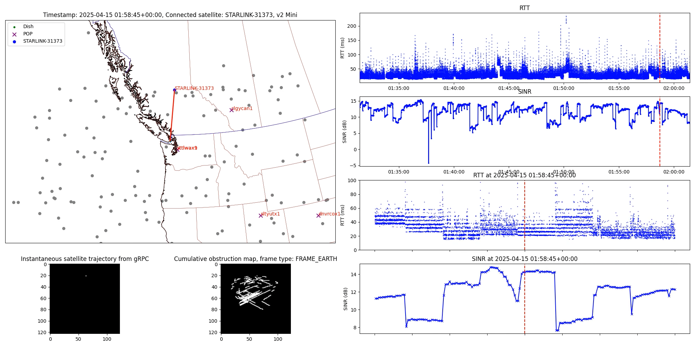
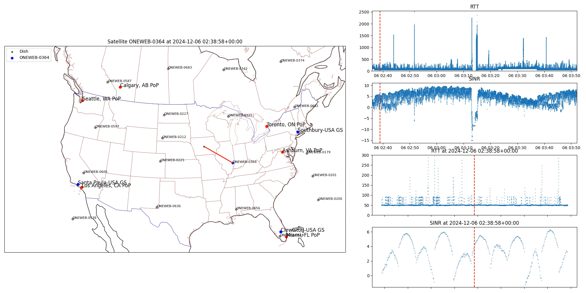

# LEOViz

⚠️ This repository provides a Proof-of-Concept implementation to visualize the connected satellites, SINR and network latency of Starlink and OneWeb user terminals. The implementation is not optimized and is intended for research purposes only.

Table of Contents

- [Starlink](#starlink)
    - [How to](#how-to)
        - [Prerequisites](#prerequisites)
        - [Data Collection](#data-collection)
        - [Visualization](#visualization)
    - [Note](#note)
- [OneWeb](#oneweb)

# Starlink

[](https://onlineacademiccommunity.uvic.ca/starlink/wp-content/uploads/sites/8876/2025/04/victoria.mp4)

*(Click to watch the video)*

## How to

### Prerequisites

+ Docker

  To install Docker on Linux, you can use `curl -fsSL https://get.docker.com | bash` or follow the instructions on the [Docker website](https://docs.docker.com/get-docker/).

  OCI containers such as Podman might work, but it is not tested.

A pre-built Docker image for `linux/amd64` is available at [docker.io/clarkzjw/leoviz:starlink](https://hub.docker.com/r/clarkzjw/leoviz/tags).

+ Starlink dish firmware `2025.04.08.cr53207` or later

  Since firmware version [`2025.04.08.cr53207 / 05de8289-7bcc-476b-ad62-8cf8cc2a73fe.uterm_manifest.release`](https://github.com/clarkzjw/starlink-grpc-golang/blob/a5267431cc5fc0560c50918afa1c0daff20b4b3f/pkg/spacex.com/api/device/dish.pb.go#L1369), Starlink gRPC interface exposes `phyRxBeamSnrAvg` in the `get_status` method. Note that depending on the dish hardware model, the supported firmware version might differ. You can check whether your current firmware version exposes this field by running the following command with [`grpcurl`](https://github.com/fullstorydev/grpcurl):

  ```bash
  grpcurl -plaintext -d {\"get_status\":{}} 192.168.100.1:9200 SpaceX.API.Device.Device/Handle | grep phyRxBeamSnrAvg
  ```

### Data Collection

The first step is to run measurements to collect data, including the Starlink dish SINR, network latency and obstruction map.

```bash
docker run -it --rm \
  -e STARLINK_DEFAULT_GW=100.64.0.1 \
  -e STARLINK_GRPC_ADDR_PORT=192.168.100.1:9200 \
  -e IFCE=eth0 \       # replace this with the network interface name connected to Starlink
  -e DURATION=2m \     # replace with the expected measurement duration
  -v ./data:/app/starlink/data \
  --network host \
  clarkzjw/leoviz:starlink \
  poetry run python3 main.py --run-once --lat LAT --lon LON --alt ALT
```

You will see the following message on the terminal:

```
Starlink gRPC address: 192.168.100.1:9200
Starlink default gateway: 100.64.0.1
Measurement interval: 10ms
Measurement duration: 2m
[2025-04-13 06:33:18,780] [INFO] ICMP_PING, <_MainThread(MainThread, started 140602590661504)>
[2025-04-13 06:33:18,784] [INFO] GRPC_GetStatus, <_MainThread(MainThread, started 140602590661504)>
[2025-04-13 06:33:18,791] [INFO] GRPC_GetObstructionMap, <_MainThread(MainThread, started 140602590661504)>
[2025-04-13 06:33:18,812] [INFO] GRPC_phyRxBeamSnrAvg, <_MainThread(MainThread, started 140602590661504)>
[2025-04-13 06:33:19,570] [INFO] save grpc status to data/grpc/2025-04-13/GetStatus-2025-04-13-06-33-18.txt
Loaded 7206 Starlink TLE satellites
[2025-04-13 06:33:27,548] [INFO] clearing obstruction map data
...
[2025-04-13 06:35:12,481] [INFO] clearing obstruction map data
[2025-04-13 06:35:18,793] [INFO] save rtt measurement to data/latency/2025-04-13/ping-10ms-2m-2025-04-13-06-33-18.txt
[2025-04-13 06:35:19,728] [INFO] save sinr measurement to data/grpc/2025-04-13/PhyRxBeamSnrAvg-2025-04-13-06-33-18.csv
[2025-04-13 06:35:27,605] [INFO] saved obstruction map data to data/grpc/2025-04-13/obstruction_map-2025-04-13-06-33-18.parquet
2025-04-13 06:33:27.607699+00:00
...
2025-04-13 06:35:26.346231+00:00
start:  1744526007.607699
end:  1744526126.346231
Processing data for 2025-04-13 06:33:27+00:00
...
Processing data for 2025-04-13 06:35:12+00:00
Updated data saved to 'data/serving_satellite_data-2025-04-13-06-33-18.csv'
```

If successful, you will see the following files in the `data` directory:

```bash
.
└── data
    ├── grpc
    │   └── 2025-04-13
    │       ├── GetStatus-2025-04-13-06-33-18.txt
    │       ├── obstruction_map-2025-04-13-06-33-18.parquet
    │       └── PhyRxBeamSnrAvg-2025-04-13-06-33-18.csv
    ├── latency
    │   └── 2025-04-13
    │       └── ping-10ms-2025-04-13-06-33-18.txt
    ├── obstruction-data-2025-04-13-06-33-18.csv
    ├── obstruction_map-2025-04-13-06-33-18.mp4
    ├── processed_obstruction-data-2025-04-13-06-33-18.csv
    ├── serving_satellite_data-2025-04-13-06-33-18.csv
    └── TLE
        └── 2025-04-13
            └── starlink-tle-2025-04-13-06-33-18.txt
```

`serving_satellite_data-*.csv` contains the estimated connected satellites of your dish. For example,

```csv
Timestamp,Y,X,Elevation,Azimuth,Connected_Satellite,Distance
2025-04-13 06:33:28+00:00,68,48,69.80325697742126,243.434948822922,STARLINK-3981,571.567435369088
2025-04-13 06:33:29+00:00,68,48,69.80325697742126,243.434948822922,STARLINK-3981,570.4028511654501
...
```

`obstruction_map-2025-04-13-06-33-18.mp4` shows the instantaneous obstruction map of your dish and the satellite trajectories within each 15-second timeslot. The measurement script clears the obstruction map data every 15 seconds to reliably estimate the connected satellites.

**Note**

`--lat`, `--lon` and `--alt` are the latitude, longitude and altitude of the dish, respectively, which is needed to correlate with the obstruction map to estimate the connected satellites of your dish.

If you enable location access from the Starlink app (`Advanced`->`Debug data`->`Starlink location`->`Allow access on local network`), you can obtain the coordinates of your dish using the following command:

```bash
grpcurl -plaintext -d "{\"get_location\":{\"source\": \"GPS\"}}" 192.168.100.1:9200 SpaceX.API.Device.Device/Handle
```

Otherwise, you will see the following error:

```bash
ERROR:
  Code: PermissionDenied
  Message: GetLocation requests are not enabled on this device
```

### Visualization

To generate the visualization video with the data collected in the previous step, run the following command:

```bash
docker run -it --rm \
  -v ./data:/app/starlink/data \
  clarkzjw/leoviz:starlink \
  poetry run python3 plot.py --lat LAT --lon LON --id 2025-04-13-06-33-18
```

Replace the `id` parameter with the date and time of the measurement data collected in the previous step from the filenames.

You will see the following message on the terminal:

```
2025-04-13 06:33:28+00:00 STARLINK-3981
50.00593532211408 4.9336084283674255 STARLINK-3981
...
2025-04-13 06:35:26+00:00 STARLINK-4130
52.12308483689548 9.764894515406029 STARLINK-4130
...
[libx264 @ 0x55ff3e10c700] ref B L1: 97.6%  2.4%
[libx264 @ 0x55ff3e10c700] kb/s:755.49
Video created: ./data/starlink-2025-04-13-06-33-18.mp4
```

If successful, you will find the video file `starlink-2025-04-13-06-33-18.mp4` in the `data` directory.

## Note

The method used to estimate the connected satellites is based on our previous paper [Trajectory-based Serving Satellite Identification with User Terminal's Field-of-View](https://dl.acm.org/doi/10.1145/3697253.3697266).

```bibtex
@inproceedings{10.1145/3697253.3697266,
author = {Ahangarpour, Ali and Zhao, Jinwei and Pan, Jianping},
title = {Trajectory-based Serving Satellite Identification with User Terminal's Field-of-View},
year = {2024},
isbn = {9798400712807},
publisher = {Association for Computing Machinery},
address = {New York, NY, USA},
url = {https://doi.org/10.1145/3697253.3697266},
doi = {10.1145/3697253.3697266},
abstract = {Low-Earth-Orbit (LEO) satellite networks, such as SpaceX's Starlink, achieved global broadband Internet coverage with significantly lower latency and higher throughput than traditional satellite Internet service providers utilizing geostationary satellites. Despite the substantial advancements, the research community lacks detailed insights into the internal mechanisms of these networks. This paper presents the first systematic study of Starlink's obstruction map and serving satellite identification. Our method achieves almost unambiguous satellite identification by incorporating satellite trajectories and proposing an accurate Field-of-View (FOV) estimation approach. We validate our methodology using multiple Starlink dishes with varying alignment parameters and latitudes across different continents. We utilize Two-Line Element data to identify the available satellites within the user terminal's FOV and examine their characteristics, in comparison to those of the serving satellites. Our approach revealed a correlation between the satellite selection strategy and the user terminal to gateway latency. The findings contribute to the broader understanding of the architecture of LEO satellite networks and their impact on user experience.},
booktitle = {Proceedings of the 2nd International Workshop on LEO Networking and Communication},
pages = {55–60},
numpages = {6},
keywords = {Field-of-View, Low Earth Orbit Satellite Networks, Satellite Identification},
location = {Washington, DC, USA},
series = {LEO-NET '24}
}
```

# OneWeb

[](https://onlineacademiccommunity.uvic.ca/oneweb/wp-content/uploads/sites/9326/2025/03/oneweb-2024-12-06-02-36-02.mp4)

*(Click to watch the video)*

The measurement scripts are compatible and tested with the following OneWeb user terminals

+ Hughes HL1120

⚠️ **To be added.**